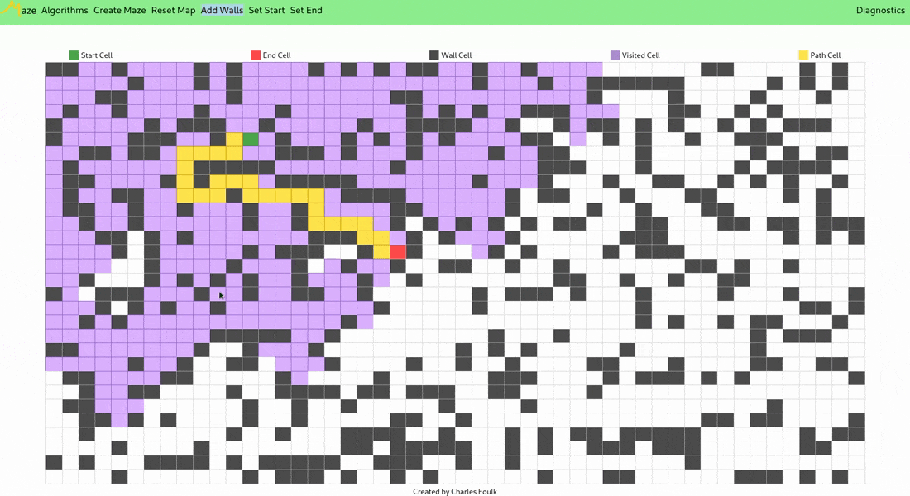

<h1 align="center">
  <br>
  <a href="https://cfoulk.github.io/Maze/"></a>
  <br>
  Maze
  <br>
</h1> 

<p align="center">
  <a href="https://github.com/cfoulk/Maze/blob/main/LICENSE">
    
    </a>
</p>

<h4 align="center">Maze is a website that visualizes graph pathfinding algorithms. Built entirely in Vanilla Javascript, HTML, & CSS</h4>

<p align="center">
  <a href="#key-features">Key Features</a> •
  <a href="#how-to-use">Use Locally</a> •
  <a href="#contact">Contact</a>
</p>



## <a name="key-features">Key Features</a>

* Visualization of pathfinding algorithms
    * Breadth-First Search
    * Depth-First Search
* User control of start/end points
* User can control the flow of algorithms with the use of walls(blocking paths) 
* Live visual recreations with user input
    * Changing walls with change the flow of visited cells
    * Move start/end points
* Maze creation presets
    * Randomized maze
* Mobile support across browers and platforms
* Responsive layout
* Draggable diagnostic panel

## <a name="how-to-use">Use Locally</a>

<p align="">If you want to mess around with the source code, you can clone this repository and setup your own local http server.</p>

```bash
# Clone this repository
$ git clone https://github.com/cfoulk/Maze

# enter new repository directory
$ cd Maze

# open project with a local http server
$ live-server .

# or with python
$ python3 -m http.server
```

## <a name="contact">Contact</a>

**Email:** [charlesfoulk@csus.edu](mailto:charlesfoulk@csus.edu)

**Github:** [@cfoulk](https://github.com/cfoulk)
